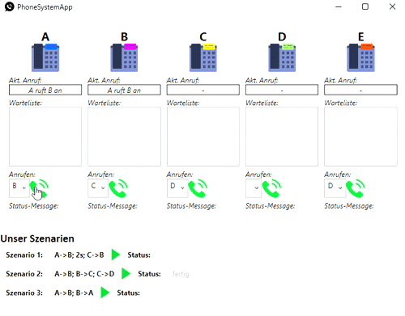

# PhoneSystemApp
Simulation of a telephone switchboard using threads and semaphores. Implemented with C#, WPF and Model View ViewModel (MVVM) as desing patern. 

  

## Getting Started
To execute the methods locally following steps are needed:

### Prerequisites
* Visual Studio 14 (Other versions work probably as well but have not been tested.)

### Installation
- 

## Usage
Open `PhoneSystemApp.sln` in Visual Studio.
